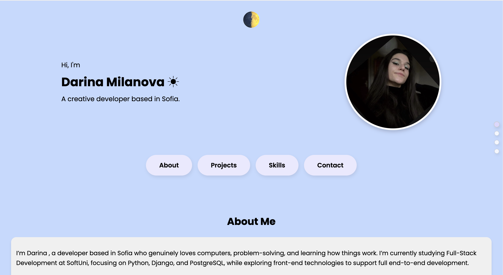
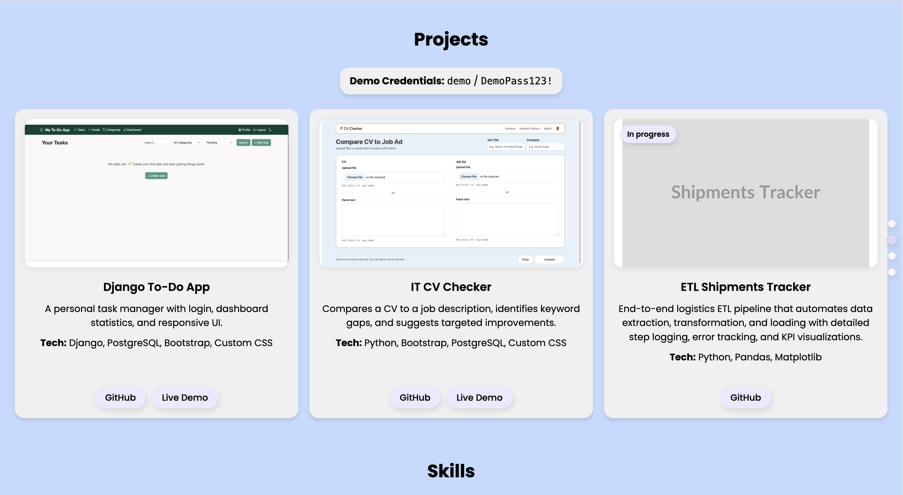
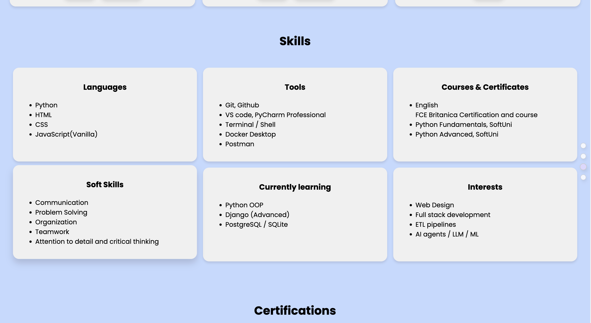
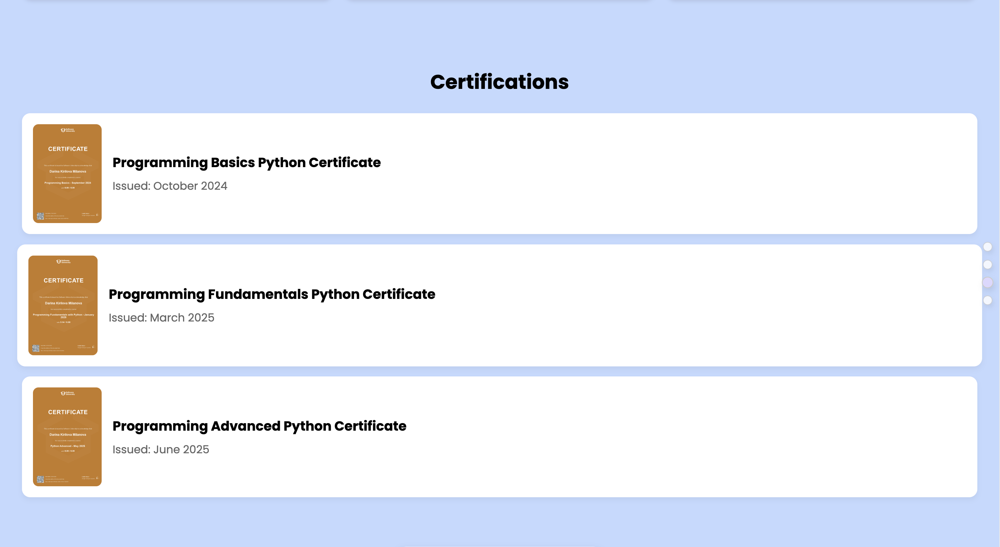
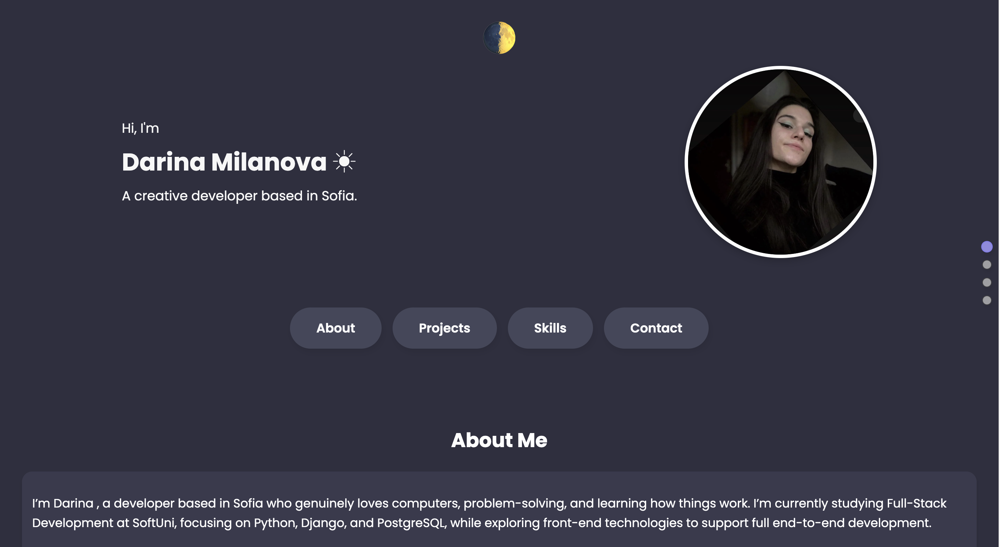
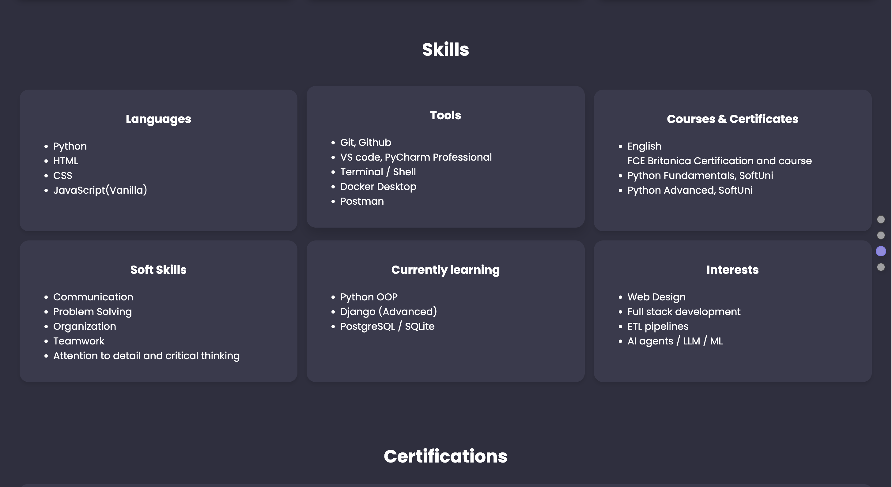
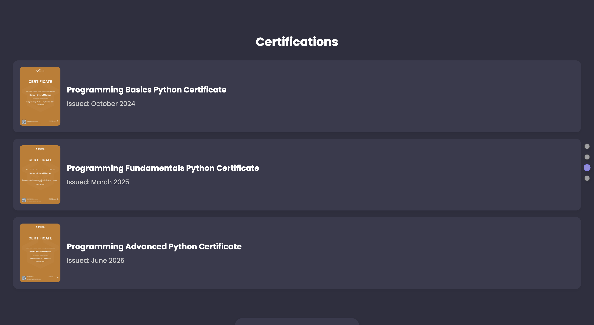

# Portfolio — Darina Milanova

A personal, fully responsive portfolio website designed to showcase my **projects, technical skills, and achievements**, built with **HTML, CSS, and JavaScript**.


---

**Live Demo:** https://portfolio-mnp4.onrender.com

---

## Features
- Smooth scroll navigation with active dot indicators
- Light/Dark mode toggle 🌗 
- Certificate lightbox viewer (click to enlarge)
- Project cards with GitHub and Live Demo links
- Fully responsive layout

---

## Project Structure

```
portfolio/
│
├── index.html                # Main HTML file
├── css/
│   ├── style.css             # Light theme and core styles
│   └── dark.css              # Dark theme overrides
│
├── images/                   # Profile and project images
├── certifications/           # Certificate PNGs
├── screenshots/              # README screenshots (light & dark)
├── script.js                 # Theme toggle, dot-nav active state, lightbox
└── README.md
```

---

## Sections

1. **About Me** — Short introduction and career focus  
2. **Projects** — Highlighted applications and demos  
3. **Skills** — Technical and soft skills grouped by category  
4. **Certifications** — Interactive modal previews of certificates  
5. **Contact** — Social and email links

---

## Design Highlights
- Soft **blue–purple** color palette
- Rounded “pill” elements for a cohesive aesthetic
- Poppins font for modern readability
- Smooth transitions, consistent shadows, and section spacing

---

## Screenshots

### Light Mode





### Dark Mode





## Deployment

Deployed via Render:
1. Push repository to GitHub  
2. Connect Render for static site deployment  
3. Auto-deploy on main branch updates

---

## Tech Stack
| Area      | Technologies                                      |
|-----------|---------------------------------------------------|
| Structure | HTML5                                             |
| Styling   | CSS3 (Flexbox, Grid, Media Queries)               |
| Scripting | Vanilla JavaScript (DOM, IntersectionObserver for active dots) |
| Hosting   | Render.com                                        |

---

## 👩🏻‍💻 Author

**Darina Milanova**  
Built with ❤️ using HTML, CSS & JavaScript

📧 darinakmilanova@gmail.com  
🔗 https://www.linkedin.com/in/darina-milanova-a64240241/  
💻 https://github.com/DarinaMilanova
